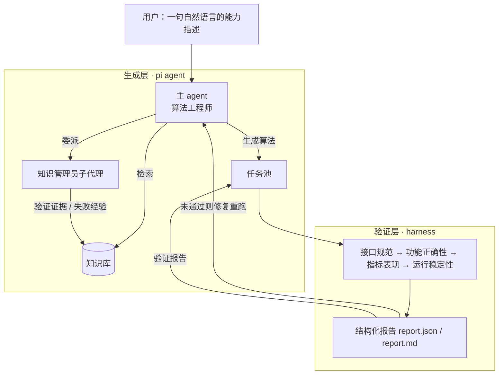

# 算法能力工厂（AI Algorithm Capability Factory）

> 把散落在资料里的「行业算法能力」抽出来沉淀成可检索的知识库，再由 AI Agent 检索它、
> 复刻出**可运行、可验证**的算法代码——一条「能力抽取 → 能力复刻 → 能力验证与沉淀」的
> 端到端半自主闭环。

| | |
|---|---|
| **默认分支** | `clean-text-cls` —— 文本分类场景 |
| 验证机制 | `algorithm-coach/harness/` —— 四模块 19 项检查，产出结构化报告 |
| 知识库 | `algorithm-coach/knowledge/` —— 24 张能力卡 / 112 条边 + 校验器 + 索引 |

## 目录

```text
algorithm-coach/   算法能力工厂：知识库、验证机制、示例与自测
pi-main/           Pi Agent 底层框架（随仓库提供，含 lock 文件）
requirements.txt   Python 依赖
agent.md           Git 提交边界说明
```

---

## 1. 项目背景和目标

大模型时代，算法开发正在从「人工理解需求—手工写代码—人工测试」转向
「需求理解—能力抽取—算法复刻—自动验证—能力沉淀」。但在真实场景里，算法能力
往往散落在文档、代码仓库、实验记录和经验里，没有被结构化，也就没法被复用。

本系统是这道题的一个小型原型：**让 AI Agent 从行业资料里抽取能力、沉淀成知识库，
再检索这个知识库去复刻算法，并在一个统一的验证机制下真跑、真判、真的把结论写回知识库。**

当前选定的场景是**文本分类**（任务书明确列举的场景之一）：输入一段文本，输出它的类别。
它有真实可学的信号、评估口径干净（准确率 / 宏 F1 / 混淆矩阵），
能把精力集中在**系统本身**——能力的抽取、检索、复刻与验证。

## 2. 系统架构和模块设计



| 模块 | 位置 | 职责 |
|---|---|---|
| **生成层** | `pi-main/`（随仓库提供） | pi coding-agent 框架：Agent 循环、LLM 接入、工具调用、会话管理 |
| **规则层** | `algorithm-coach/AGENTS.md` | 角色与写权限、检索协议、算法契约、验收命令、语言与落盘规则 |
| **知识层** | `algorithm-coach/knowledge/` | 四池结构（原始 → 提炼 → 复用 → 任务）+ 知识图谱 + 校验器 + 索引 |
| **验证层** | `algorithm-coach/harness/` | 四模块检查（接口规范／功能正确性／指标表现／运行稳定性）+ 报告 |
| **扩展层** | `algorithm-coach/.pi/` | subagent 扩展、知识管理员 agent 定义、项目技能 |
| 示例与工具 | `algorithm-coach/` 下的 `examples/`、`scripts/`、`tests/` | 契约化的示例算法、知识库工具脚本、38 个自测用例 |

## 3. 能力知识图谱 schema 和示例

**权威划分：结构进 CSV，散文留 MD。** 这是本项目的核心设计决定，也是踩过坑之后的结论。

早先结构与正文耦合在每张卡片里（边写在卡末的「相关能力」小节、字段写在 frontmatter），
后果有三：agent 要遍历图就得把整张卡读进上下文——一张 3–6k 字符，走两跳要开 19 个
文件、5.5 万字符，所以它只能"读索引猜 1–3 张卡"；解析器只抓得到卡片内容的一个子集
（边的判断依据根本抓不到，少东西还不报错）；图没法交给别的工具。

现在分成两个本体，**每个字段只归一个**：

| 本体 | 文件 | 管什么 |
|---|---|---|
| 结构本体 | `knowledge/复用池/nodes.csv`、`edges.csv` | 节点是谁、边怎么连、状态与溯源 |
| 内容本体 | `knowledge/复用池/<类目>/<id>.md` | 卡片正文（标题 + 各章节散文） |

于是**遍历读两张表（全库结构不到 2 万字符），只对选中的卡读正文**。派生物
`knowledge/知识库索引.md` 与 `复用池/graph.graphml` 由脚本从两个 CSV 生成——
后者给 Gephi 双击打开，边带类型可上色过滤。

**卡片结构**（完整规范见 `knowledge/知识图谱schema.md`）：

- **结构侧**：`nodes.csv` 四列 `id,category,status,sources`（id 就是文件名）；
  `edges.csv` 四列 `from_id,to_id,type,reason`（四种边型各有固定方向）
- **两类卡**：能力卡（正文含能力说明、输入契约、输出契约、调用方式、关键参数、
  依赖、适用条件、不适用条件）；失败模式卡（错误模式、触发场景、如何识别、后果、
  修复规则）
- **status 三值**：`已验证`（原文有真实运行结果）/ `待验证`（只有方法）/ `有缺陷`（已验证的错误做法，仅作反例）
- **五类边**：上游依赖 / 下游用途 / 常见误用 / 并列替代 / 实证证据——每条边都带一句
  **判断依据**，让它可以被反驳

一张真实卡片的片段（`knowledge/复用池/02_高级特征工程/TF-IDF词项加权.md`）：

`nodes.csv` 里的一行：

```csv
TF-IDF词项加权,02_高级特征工程,已验证,提炼池/线上博客/文本分类专题/scikit-learn_文本特征提取文档.md;提炼池/线上博客/csdn/csdncopy.md
```

`edges.csv` 里的一行（`依赖` 的 from 是上游）：

```csv
文本预处理与分词,词袋与N-gram文本表示,依赖,词袋的 tokenizer/analyzer 直接复用本环节产出，分词与归一化策略决定词表内容
```

对应卡片 `复用池/02_高级特征工程/TF-IDF词项加权.md` 只留正文：`# TF-IDF 词项加权`
+ 八个能力章节 + 验证状态 + 来源，没有 frontmatter，也没有「相关能力」。

**当前规模**：24 张卡 / 78 条边；状态分布 已验证 15、待验证 7、有缺陷 2。
边型分布 依赖 41、并列替代 20、常见误用 10、实证证据 7。

**四道质量闸**：`scripts/validate_knowledge.py`（三层校验，29 类违规自测）、
`scripts/gen_knowledge_index.py`（索引 + graph.graphml，自带回归测试）、
`scripts/edit_graph.py`（改结构前先验改动本身合不合法）、
`tests/test_validate_knowledge.py`（校验器自身的自测）。

## 4. Agent 工作流设计

| 步 | 谁做 | 做什么 |
|---|---|---|
| a 理解能力描述 | 主 agent | 读用户那句话，抽出任务对象 / 预测目标 / 口径 |
| b 检索相关能力 | 主 agent | 读 `nodes.csv` + `edges.csv`（整张图一次读完），按 status／边型／度数排序收窄到 1-3 个候选，只对选中的卡读正文 |
| c 规划实现方案 | 主 agent | 写分析方案（选什么特征 / 模型，依据哪张卡） |
| d 生成可运行代码 | 主 agent | 按交付契约写 `algorithm.py` + `manifest.json` + `run.py` + `README.md` |
| e 自动测试与指标评估 | **harness** | 四模块 19 项检查，判据取自知识库的失败卡 |
| f 按错误修复 | 主 agent | 读 `report.json` 的 `detail` / `location` / `kb_card`，改完重跑 |
| g 沉淀回知识库 | **知识管理员子代理** | 把真实数字沉淀成 `07_验证证据` 卡，或把踩的坑沉淀成 `06_失败经验` 卡 |

**两个角色，写权限互斥**：主 agent（算法工程师）只能写任务池；知识库三池只有
被委派的**知识管理员**能写。这条不是形式主义——它让"能力沉淀"必须经过一次
独立的、按 schema 校验的写入，避免主 agent 顺手把没验证的东西塞进知识库。

## 5. 环境配置和运行方法

三步配齐（也见仓库根的 `requirements.txt`）：

```bash
# 1) Python ≥ 3.9
pip install -r requirements.txt

# 2) Node ≥ 22.19（跑 agent 生成算法才需要；框架随仓库提供）
cd pi-main && npm install --ignore-scripts

# 3) LLM 凭据
$env:OPENCODE_API_KEY="<your-key>"      # bash: export OPENCODE_API_KEY=...
```

**跑验证**（不需要 Node）：

```bash
cd algorithm-coach
python -m harness validate examples/text_cls_demo/generated \
    --data examples/text_cls_demo/data/agnews_sample.csv \
    --out  examples/text_cls_demo/validation
```

**跑生成出来的算法**（用户视角，不需要 harness）：

```bash
cd examples/text_cls_demo/generated
python run.py --data ../data/agnews_sample.csv --out 预测.csv
```

**启动 agent**：

```powershell
$env:OPENCODE_API_KEY = "<your-key>"
Set-Location "D:\awork\akf\llmagent\code\algorithm-coach"    # ← 这步不能省

powershell.exe -NoProfile -ExecutionPolicy Bypass `
  -File "..\pi-main\pi-test.ps1" `
  --model opencode-go/deepseek-v4.1-flash `
  --thinking max `
  --tools read,powershell,edit,write,grep,find,ls,subagent
```

**跑自测**：

```bash
cd algorithm-coach
python -m unittest tests.test_harness tests.test_harness_classification tests.test_knowledge_index
python tests/test_validate_knowledge.py
```

## 6. 示例数据和测试任务说明

**示例数据**：`examples/text_cls_demo/data/agnews_sample.csv` —— AG News 四分类
（World / Sports / Business / SciTech）的分层抽样，**4000 行、四类各 1000、均衡**。
公开数据集，仓库里带这一份是为了让整条链路可以离线复现。

**知识库的素材**：8 份外部资料（4 篇 arXiv 综述、HuggingFace 与 scikit-learn 官方文档、
一份 GitHub 精选清单、一篇 CSDN 综述），全部落在 `原始池`，逐份提炼进 `提炼池`，
再抽成能力卡。付费材料不入仓库。

**跑过的任务**（完整记录在 `knowledge/任务池/`）：

| 任务 | 结果 | 说明 |
|---|---|---|
| `2026-10-02_agnews_四分类` | **19/19 通过** | 完整交付形态（`generated/` 四件 + `validation/`），准确率 0.885 / 宏 F1 0.884 |
| `2026-10-01_agnews_四分类` | 18/18 通过 | 第一次跑通交付层；文件在 git 历史 `9762068` 里可取回 |

## 7. 生成算法代码示例

生成的算法不是"一份被 harness 调用的模块"，而是**一份能独立交付的算法包**：

```
generated/                   ← 交给用户的部分，自包含、可独立运行
├── algorithm.py               算法核心：build_features / fit / predict 三个纯函数
├── manifest.json              元数据：任务类型、标签口径、类别、随机种子
├── run.py                     运行入口：读数据 → 训练 → 预测 → 写结果
└── README.md                  使用说明（含可直接复制运行的命令）
validation/                  ← harness 报告（给人看质量，运行不需要）
```

`algorithm.py` 只依赖 pandas / numpy / scikit-learn，**不依赖本项目的任何代码**；
用户拿到目录就能跑，不需要装 harness、更不需要知道这个仓库存在。

以 `knowledge/任务池/2026-10-02_agnews_四分类/generated/` 为例：TF-IDF（词 1-2gram）
+ 补齐朴素贝叶斯的硬投票集成，实测准确率 **0.885**、宏 F1 **0.884**，
4000 行数据全程不到 3 秒。

## 8. 验证结果和报告样例

`harness` 对每个算法做四类检查，共 19 项：

| 模块 | 检查项 | 抓什么 |
|---|---|---|
| 接口规范（闸门） | 7 项 | 提交物齐全、manifest 合法、可导入、函数齐全、签名正确、冒烟、**交付物可独立运行** |
| 功能正确性 | 5 项 | 行数守恒、标签口径对账、**拟合范围一致性（反泄漏）**、预测输出有效性、朴素基线 |
| 指标表现 | 3 项 | 精度账（对标多数类基线与自带参考基线）、类别分布披露、训练/测试差距 |
| 运行稳定性 | 4 项 | 时间预算、确定性、小样本不崩、坏数据不崩 |

样例（`knowledge/任务池/2026-10-02_agnews_四分类/validation/report.md`）：

> 准确率 0.885 ｜ 宏 F1 0.884 ｜ 多数类基线 0.250 ｜ 参考基线 TF-IDF+LR 0.875
> 拟合范围一致性 ✓（训练段 3200 行逐行一致）｜ 训练/测试差距 +6.1 个百分点

报告不粉饰：**验证机制的价值在于它敢判负**——任一项没过，结论就是未通过，
并逐条给出出错位置与依据的知识卡，让人知道该改哪儿。

## 9. 遇到的挑战和解决方案

1. **"能验证"不等于"能交付"**。早期生成的算法只有三个函数，是给 harness 调用的零件——
   用户拿到手跑不起来。→ 补出交付层：`run.py` + `README.md` 成为契约的一部分，
   并新增「交付物完整性」检查（`--help` 起不起得来、喂小数据能不能真产出预测）。

2. **文档里的命令跑不了**。生成的 README 里写的是 `--data 数据.csv`，而那个文件并不存在。
   → 契约加一条：README 必须含**一条用本任务实际数据、可直接复制运行**的命令；
   harness 会检查 `--data` 指向的路径是否真实存在。

3. **生成物没人读就会烂**。知识库索引是自动生成的，于是没人读它——`92 张卡`（写死的旧数字）
   和一张恒为空的类别连接密度矩阵就这么活了下来。→ 给索引生成器补 5 个回归测试：
   卡片数必须来自实际文件、矩阵必须非空且边数守恒、每张卡都必须出现。

贯穿这三条的是同一个原则：**没有对照的成绩单不算成绩**。指标必须和基线比
（分类任务对标多数类基线与自带参考基线）、结论必须可复现（同种子两次运行一致）、
失败必须如实记录——验证机制里的判据，都是从这类教训里长出来的。

## 10. 后续可扩展方向

- **验证配置插件化**：检查项目前按任务类型分派，可进一步做成插件式注册
  新的算法模板与评估指标
- **多候选方案自动比较**：agent 已经会离线比较多个候选配置，可把它做成系统能力
  （候选池 → 并行验证 → 择优交付）
- **图搜索 / Beam Search 选方案**：在知识库图上做能力组合搜索
- **接 Neo4j / 图算法分析**：结构本体已是点边两张表，`LOAD CSV` 直接可导；
  若要更细的图算法，可再补一份 nodes/edges 的 JSON（同一次运行生成，避免产物漂移）
- **沙箱执行**：当前用子进程 + 超时隔离，可升级为受限文件系统 / 网络的沙箱
