# 算法能力工厂（AI Algorithm Capability Factory）

## 1. 项目背景和目标

大模型时代，算法开发正在从「人工理解需求—手工写代码—人工测试」转向
「需求理解—能力抽取—算法复刻—自动验证—能力沉淀」。但在真实场景里，算法能力
往往散落在文档、代码仓库、实验记录和经验里，没有被结构化，也就没法被复用。

本系统是这道题的一个小型原型：**让 AI Agent 从行业资料里抽取能力、沉淀成知识库，
再检索这个知识库去复刻算法，并在一个统一的验证机制下真跑、真判、真的把结论写回知识库。**

当前选定的场景是**文本分类**（任务书明确列举的场景之一）：输入一段文本，输出它的类别。
它有真实可学的信号、评估口径干净（准确率 / 宏 F1 / 混淆矩阵），
能把精力集中在**系统本身**——能力的抽取、检索、复刻与验证。

## 2. 系统架构和模块设计

### 2.1 总体架构

系统由 [Pi Agent 框架](https://github.com/earendil-works/pi)和 Algorithm Coach 业务层组成。`pi-main/` 提供模型接入、
会话管理与工具调用；`algorithm-coach/` 定义知识组织方式、算法交付契约和验证规则。
用户通过 Pi 的命令行界面发起任务，主 Agent 检索知识、制定方案并生成代码，
Harness 对任务产物进行验证。任务池保存代码、实验结果和报告；经主 Agent 委派，
知识管理员将可复用的验证证据或失败经验写回知识库。

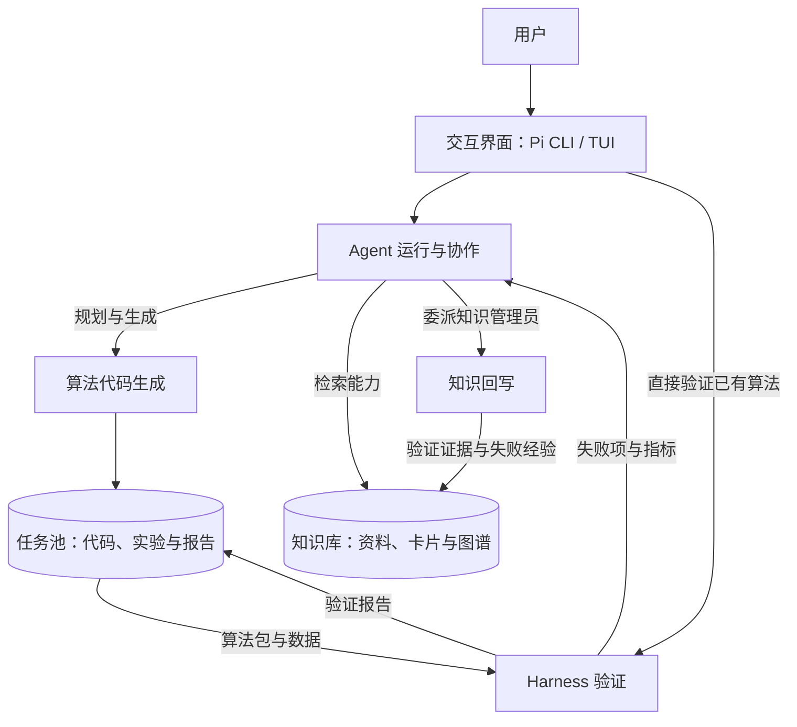

五个模块按功能划分，任务池是它们共享的任务产物区：

| 模块 | 主要实现位置 | 职责 |
|---|---|---|
| Agent 交互与协作框架 | `pi-main/`、`algorithm-coach/AGENTS.md`、`algorithm-coach/.pi/` | 管理任务执行、工具调用、角色分工和修复流程 |
| 知识库构建与反馈更新 | `algorithm-coach/knowledge/`、`algorithm-coach/scripts/` | 管理资料、能力图谱、检索、可视化和结果沉淀 |
| Harness 验证 | `algorithm-coach/harness/` | 执行契约、正确性、指标与稳定性检查，生成报告 |
| 算法代码生成与扩展 | `algorithm-coach/knowledge/任务池/`、`algorithm-coach/examples/` | 形成方案、比较候选并交付可独立运行的算法包 |
| 交互界面 | Pi CLI / TUI、Harness CLI、图谱本地页面 | 接收任务、运行验证并展示结果 |

### 2.2 Agent 交互与协作框架

#### 2.2.1 Agent 运行基础与工具调用

`pi-main/` 承担 Agent 循环、模型接入、会话与工具调用。
`algorithm-coach/AGENTS.md` 和 `.pi/skills/algorithm-coach/` 则规定本项目的检索顺序、
代码交付格式、验证命令和写入权限。框架负责运行，项目规则负责约束具体任务。

选 Pi 而非 LangChain / AutoGen / CrewAI 这类编排框架：后者提供的是流程编排积木，
Agent 循环、会话管理与工具接入都要自行搭建；Pi 封装得更完整，本身就是可运行的
coding agent，Agent 对话基础更好。与 Claude Code 相比，Pi 更轻便简洁，且开放的
改造权限更多——提示词、工具、扩展点均可修改与二创，创作自由度高。

#### 2.2.2 任务工作流与多轮修复

主 Agent 依次理解需求、检索知识、规划方案、生成代码并调用 Harness。
验证未通过时，它读取 `report.json` 中的失败项、位置和知识卡依据，修改代码后重新验证；
项目技能将单个任务的修复上限设为三轮。当前任务样例主要是首次验证通过，
多轮修复流程已有规则，尚缺实际连续修复案例。

#### 2.2.3 主 Agent 与知识管理员子代理协作

主 Agent 负责任务池中的方案、代码和报告；需要入库时，通过 `subagent` 扩展委派
知识管理员维护原始池、提炼池和复用池。两个角色的写入范围由 `AGENTS.md` 限定，
知识更新完成后还需通过图谱校验。

### 2.3 知识库构建与反馈更新

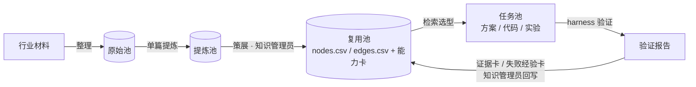

#### 2.3.1 行业材料采集与能力抽取

`knowledge/原始池/` 保存外部资料，`提炼池/` 保存从资料整理出的可追溯内容，
`复用池/` 保存可供任务检索的能力、失败经验和验证证据。示例数据与生成任务所用
的测试材料见 `examples/` 和任务池；当前应用场景是文本分类。

#### 2.3.2 能力知识图谱的组织与存储

图谱用 `复用池/nodes.csv` 与 `edges.csv` 记录节点、关系、状态和来源，
用同名 Markdown 卡片保存能力说明。字段与关系约束见 `knowledge/知识图谱schema.md`；
第 3 节给出实际记录和卡片示例。

#### 2.3.3 知识检索、校验与图谱可视化

Agent 先读取节点和边筛选相关能力，再打开命中的卡片正文。
`scripts/validate_knowledge.py` 校验图谱结构与卡片，`gen_knowledge_index.py` 生成索引，
`render_graph.py` 根据同一份图谱数据生成可交互的本地页面。

#### 2.3.4 验证证据与失败经验回写

任务验证后的报告保存在任务池。主 Agent 根据结果决定是否委派知识管理员，
将有复用价值的结论整理为 `07_验证证据` 或 `06_失败经验` 卡，并更新图谱关系。
这是由 Agent 按规则执行的知识回写流程；Harness 本身只提供验证结果，不直接修改知识库。

### 2.4 Harness 验证

#### 2.4.1 算法交付契约与验证输入

Harness 接收算法目录、数据文件及可选的验证参数。算法包以 `manifest.json` 声明任务
和数据口径，以 `algorithm.py` 提供 `build_features`、`fit`、`predict` 接口；
验证器控制数据切分并在子进程中调用算法。当前可运行的任务类型为文本分类。

#### 2.4.2 接口、正确性、指标与稳定性检查

`harness/checks/` 按四个模块组织，共 19 项；接口检查作为入口，其余覆盖预测输出、
数据泄漏、基线比较、可复现性与时间预算。判据取自交付契约与知识库卡：

| 模块 | 项数 | 检查项 | 相关代码 |
|---|---|---|---|
| 接口规范 | 7 | 提交物齐全 / manifest 合法 / 模块可导入 / 契约函数齐全 / 函数签名正确 / 冒烟运行 / 交付物完整性（可独立运行） | `harness/checks/interface.py` |
| 功能正确性 | 5 | 行数守恒 / 标签列有效性 / 拟合范围一致性（反泄漏）/ 预测输出有效性 / 多数类基线对比 | `harness/checks/correctness.py` |
| 指标表现 | 3 | 精度账（对标基线）/ 类别分布与划分披露 / 训练-测试差距 | `harness/checks/performance.py` |
| 运行稳定性 | 4 | 时间预算 / 确定性（同种子可复现）/ 小样本不崩 / 坏数据不崩 | `harness/checks/stability.py` |

子进程与超时控制用于限制单次执行时间，尚不构成完整安全沙箱。

#### 2.4.3 验证报告生成与修复反馈

验证结束后生成 `report.json` 和 `report.md`：前者供 Agent 读取检查结果、错误位置
和关联知识卡，后者供人查看指标与逐项结论。具体检查内容和报告样例见第 8 节。

### 2.5 算法代码生成与扩展

#### 2.5.1 从能力描述到算法方案

主 Agent 从用户描述中明确任务对象、输入输出和评估口径，结合图谱关系与能力卡
选择特征、模型及验证方法，并将依据写入任务方案和报告。

#### 2.5.2 候选方案实验与比较

任务池已有 `experiments/select_model.py` 等脚本，可在同一数据划分和指标口径下
比较候选模型。现阶段比较由具体任务的实验脚本完成；统一的候选池、自动并行验证
和择优交付流程仍属于扩展方向。

#### 2.5.3 可独立运行的算法代码交付

生成物包含 `algorithm.py`、`manifest.json`、`run.py` 和使用说明 `README.md`。
`run.py` 提供直接运行入口，交付物不依赖 Harness；`knowledge/任务池/` 保存任务实例，
`examples/` 提供可复现的示例。第 7 节展示交付目录与运行结果。

#### 2.5.4 算法模板与任务类型扩展设计

当前实现围绕文本分类。Harness 的检查模块支持注册，但算法模板、评估指标的
通用插件接口，以及跨表格分类等场景的任务配置尚未实现。

### 2.6 交互界面

#### 2.6.1 Pi 命令行交互入口

用户通过Pi的TUI界面用自然语言提出需求，查看 Agent 的工具调用过程和最终回复。
生成代码、实验和报告保存到对应任务目录，便于复查。

#### 2.6.2 Harness 命令行与图谱查看入口

已有算法可通过 `python -m harness validate` 单独验证；知识图谱可通过
`scripts/render_graph.py --serve` 在本地浏览器查看。两种入口的完整命令见第 4 节与第 6 节。
当前未提供独立的 Web 管理界面。

## 3. 能力知识图谱 schema 和示例

本节是摘要与示例；完整规范见 [`algorithm-coach/knowledge/知识图谱schema.md`](algorithm-coach/knowledge/知识图谱schema.md)。

**解耦划分：结构进 CSV，散文留 MD。** 这是本项目的核心设计决定，也是踩过坑之后的结论。

早先结构与正文耦合在每张卡片里（边写在卡末的「相关能力」小节、字段写在 frontmatter），
后果有三：agent 要遍历图就得把整张卡读进上下文——一张 3–6k 字符，走两跳要开 19 个
文件、5.5 万字符，所以它只能"读索引猜 1–3 张卡"；解析器只抓得到卡片内容的一个子集
（边的判断依据根本抓不到，少东西还不报错）；图没法交给别的工具。

现在分成两个本体，**每个字段只归一个**：

| 本体 | 文件 | 管什么 |
|---|---|---|
| 结构本体 | `knowledge/复用池/nodes.csv`、`edges.csv` | 节点是谁、边怎么连、状态与溯源 |
| 内容本体 | `knowledge/复用池/<类目>/<id>.md` | 卡片正文（标题 + 各章节散文） |

于是**遍历读两张表（全库结构不到 2 万字符），只对选中的卡读正文**。派生物
`knowledge/README.md` 由脚本从两个 CSV 生成；想看图谱跑 `scripts/render_graph.py`，
它读同一对 CSV，出一张自包含的可交互 HTML（同心圆布局，能拖、能按类目/状态筛、
悬停看每条边的判断依据）。

一次真实交互——输入「让我看看可视化的知识图谱」：


agent 的回答（返回本地地址 + 说明能看到什么）：

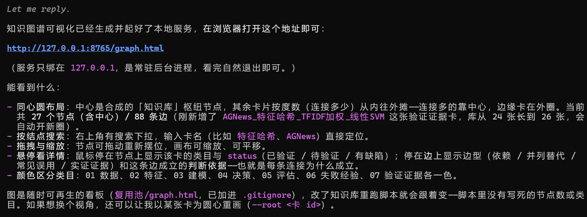

浏览器里打开的图谱：

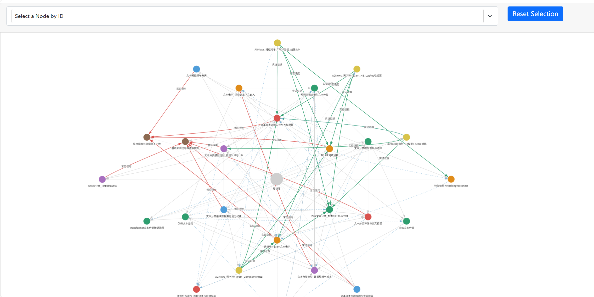

**卡片结构**（完整规范见 [`algorithm-coach/knowledge/知识图谱schema.md`](algorithm-coach/knowledge/知识图谱schema.md)）：

- **结构侧**：`nodes.csv` 四列 `id,category,status,sources`（id 就是文件名）；
  `edges.csv` 四列 `from_id,to_id,type,reason`（边型有方向约定）
- **两类卡**：能力卡（正文含能力说明、输入契约、输出契约、调用方式、关键参数、
  依赖、适用条件、不适用条件）；失败模式卡（错误模式、触发场景、如何识别、后果、
  修复规则）
- **status 三值**：`已验证`（原文有真实运行结果）/ `待验证`（只有方法）/ `有缺陷`（已验证的错误做法，仅作反例）
- **五类边**：上游依赖 / 下游用途 / 常见误用 / 并列替代 / 实证证据——每条边都带一句
  **判断依据**，让它可以被反驳

一张真实卡片的片段（`knowledge/复用池/02_高级特征工程/TF-IDF词项加权.md`）：

`nodes.csv` 里的一行：

```csv
TF-IDF词项加权,02_高级特征工程,已验证,提炼池/线上博客/文本分类专题/scikit-learn_文本特征提取文档.md;提炼池/线上博客/csdn/csdncopy.md
```

`edges.csv` 里的一行（`依赖` 的 from 是上游）：

```csv
文本预处理与分词,词袋与N-gram文本表示,依赖,词袋的 tokenizer/analyzer 直接复用本环节产出，分词与归一化策略决定词表内容
```

对应卡片 `复用池/02_高级特征工程/TF-IDF词项加权.md` 只留正文：`# TF-IDF 词项加权`
+ 八个能力章节 + 验证状态 + 来源，没有 frontmatter，也没有「相关能力」。

**当前规模**：25 张卡 / 83 条边；状态分布 已验证 16、待验证 7、有缺陷 2。
边型分布 依赖 41、并列替代 21、常见误用 10、实证证据 11。

**四道质量闸**：`scripts/validate_knowledge.py`（三层校验，29 类违规自测）、
`scripts/gen_knowledge_index.py`（索引生成，自带回归测试）、
`scripts/edit_graph.py`（改结构前先验改动本身合不合法）、
`tests/test_validate_knowledge.py`（校验器自身的自测）。
可视化是第五条：`scripts/render_graph.py` 读同一对 CSV 出可交互图谱。

## 4. Agent 工作流设计

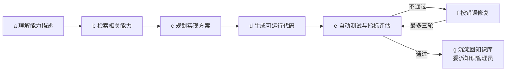

| 步 | 谁做 | 做什么 |
|---|---|---|
| a 理解能力描述 | 主 agent | 读用户那句话，抽出任务对象 / 预测目标 / 口径 |
| b 检索相关能力 | 主 agent | 读 `nodes.csv` + `edges.csv`（整张图一次读完），按 status／边型／度数排序收窄到 1-3 个候选，只对选中的卡读正文 |
| c 规划实现方案 | 主 agent | 写分析方案（选什么特征 / 模型，依据哪张卡） |
| d 生成可运行代码 | 主 agent | 按交付契约写 `algorithm.py` + `manifest.json` + `run.py` + `README.md` |
| e 自动测试与指标评估 | **harness** | 四模块 19 项检查，判据取自知识库的失败卡 |
| f 按错误修复 | 主 agent | 读 `report.json` 的 `detail` / `location` / `kb_card`，改完重跑 |
| g 沉淀回知识库 | **知识管理员子代理** | 把真实数字沉淀成 `07_验证证据` 卡，或把踩的坑沉淀成 `06_失败经验` 卡（出现跨任务教训时委派） |

**两个角色，写权限互斥**：主 agent（算法工程师）只能写任务池；知识库三池只有
被委派的**知识管理员**能写。这条不是形式主义——它让"能力沉淀"必须经过一次
独立的、按 schema 校验的写入，避免主 agent 顺手把没验证的东西塞进知识库。

### 交互入口

用户可以在 Pi CLI / TUI 中用自然语言发起任务，也可以用 Harness CLI 验证已有算法。
生成代码、实验与验证报告保存在 `knowledge/任务池/<任务>/`。知识图谱有本地浏览器
页面；用户请求查看图谱时，Agent 可以运行下面的命令并返回访问地址：

```bash
python scripts/render_graph.py --serve     # 出图 + 起本地服务，打印访问地址
```

然后回复里给出形如 `http://127.0.0.1:8765/graph.html` 的链接（只绑 127.0.0.1，不对外）。

## 5. 环境配置和运行方法

三步配齐（也见仓库根的 `requirements.txt`）：

```bash
# 1) Python ≥ 3.9
pip install -r requirements.txt

# 2) Node ≥ 22.19（跑 agent 生成算法才需要；框架随仓库提供）
cd pi-main && npm install --ignore-scripts

# 3) LLM 凭据
$env:OPENCODE_API_KEY="<your-key>"      # bash: export OPENCODE_API_KEY=...
```

**启动 agent**：

```powershell
$env:OPENCODE_API_KEY = "<your-key>"
Set-Location "D:\awork\akf\llmagent\code\algorithm-coach"    # ← 这步不能省

powershell.exe -NoProfile -ExecutionPolicy Bypass `
  -File "..\pi-main\pi-test.ps1" `
  --model opencode-go/deepseek-v4.1-flash `
  --thinking low `
  --tools read,powershell,edit,write,grep,find,ls,subagent
```

启动后长这样——`[Context]` / `[Skills]` / `[Extensions]` 三块正是本项目加载的规则、技能与扩展：

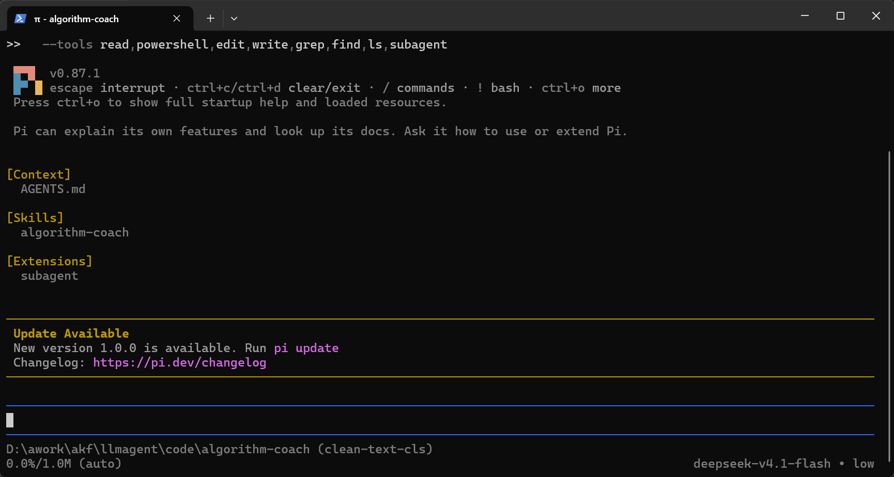

## 6. 示例数据和测试任务说明

**示例数据**：`examples/text_cls_demo/data/agnews_sample.csv` —— [AG News](https://huggingface.co/datasets/fancyzhx/ag_news) 四分类
（World / Sports / Business / SciTech）的分层抽样，**4000 行、四类各 1000、均衡**。
公开数据集，由 [Zhang et al., 2015](https://arxiv.org/abs/1509.01626) 提出；
仓库里带这一份是为了让整条链路可以离线复现。

数据就两列——`text` 是新闻正文、`label` 是四分类之一，每类挑一行（正文这里截断）：

```csv
text,label
"Stewart gets deadline. NEW YORK Martha Stewart must report to prison in less than three weeks, a federal judge ruled…",Business
"Afghans Say Trouble Inevitable But Won't Stop Vote.  KABUL (Reuters) - Afghan President Hamid Karzai vowed on Thursday…",World
"USC turns halftime into a science. Halftime lockerrooms are sacrosanct. Only the privileged few are allowed entry…",Sports
"'GM cocaine grown in Colombia'. Drug growers in Colombia are using genetically modified plants to dramatically…",SciTech
```

**知识库的素材**：8 份外部资料（4 篇 arXiv 综述、HuggingFace 与 scikit-learn 官方文档、
一份 GitHub 精选清单、一篇 CSDN 综述），全部落在 `原始池`，逐份提炼进 `提炼池`，
再抽成能力卡。付费材料不入仓库。

**跑一遍这个示例**：

先按第 5 节配好环境并启动 agent，然后输入这句提示词：

> 做一个 AG News 四分类算法，数据 `examples/text_cls_demo/data/agnews_sample.csv`，交付到任务池并用 harness 验收，不要照抄 `examples/text_cls_demo`。

一次真实运行的六个片段（同一次运行，从上到下）：

1. 先读知识图谱的结构：`nodes.csv` 与 `edges.csv` 两张表，再按命中开卡
   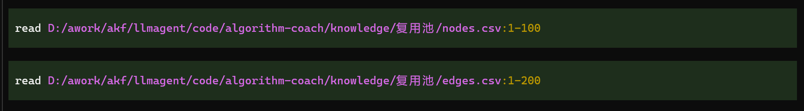
2. 读命中的验证证据卡，了解这条任务上已有哪些真实数字
   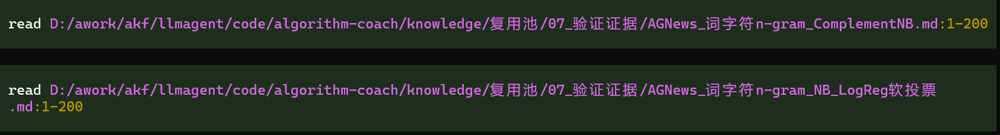
3. 枚举图谱里的候选路线
   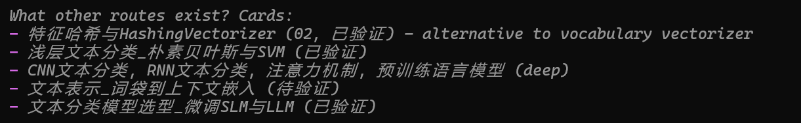
4. 选型实验：写脚本对比哈希路线的若干配置，docstring 里写明依据哪几张卡
   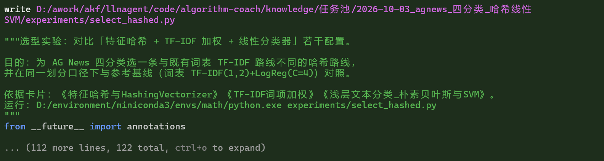
5. 统一验证：19 项检查一次通过
   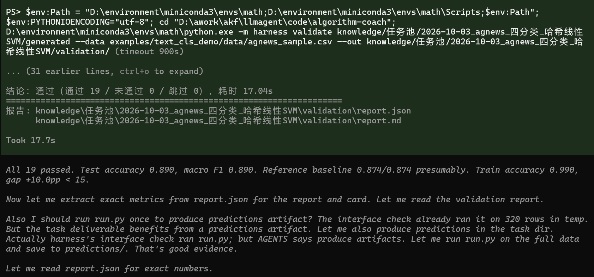
6. 结果回流：主 agent 把活委派给**子 agent**（知识管理员）——由它独立写证据卡与 5 条边、跑校验（26 节点 / 88 边 / 0 错误）
   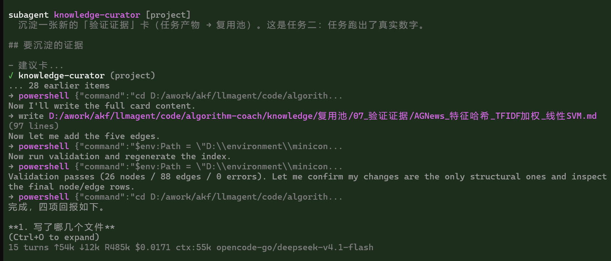

完整运行录像：[`pic/演示视频v1.mp4`](pic/演示视频v1.mp4)（19.5 MB，GitHub 上点开即可播放）

## 7. 生成算法代码示例

生成的算法不是"一份被 harness 调用的模块"，而是**一份能独立交付的算法包**：

```
generated/                   ← 交给用户的部分，自包含、可独立运行
├── algorithm.py               算法核心：build_features / fit / predict 三个纯函数
├── manifest.json              元数据：任务类型、标签口径、类别、随机种子
├── run.py                     运行入口：读数据 → 训练 → 预测 → 写结果
└── README.md                  使用说明（含可直接复制运行的命令）
validation/                  ← harness 报告（给人看质量，运行不需要）
```

`algorithm.py` 只依赖 pandas / numpy / scikit-learn，**不依赖本项目的任何代码**；
用户拿到目录就能跑，不需要装 harness、更不需要知道这个仓库存在。

以 `knowledge/任务池/2026-10-03_agnews_四分类_哈希线性SVM/generated/` 为例：特征哈希
（词 1/2-gram ∪ 词内字符 3/5-gram，哈希到 2^18 维）+ TF-IDF 加权 + LinearSVC(C=0.5)，
实测准确率 **0.890**、宏 F1 **0.890**，4000 行数据特征提取 0.4 秒、训练加预测 1.2 秒。

## 8. 验证结果和报告样例

`harness` 对每个算法做四类检查，共 19 项：

| 模块 | 检查项 | 抓什么 |
|---|---|---|
| 接口规范（闸门） | 7 项 | 提交物齐全、manifest 合法、可导入、函数齐全、签名正确、冒烟、**交付物可独立运行** |
| 功能正确性 | 5 项 | 行数守恒、标签口径对账、**拟合范围一致性（反泄漏）**、预测输出有效性、朴素基线 |
| 指标表现 | 3 项 | 精度账（对标多数类基线与自带参考基线）、类别分布披露、训练/测试差距 |
| 运行稳定性 | 4 项 | 时间预算、确定性、小样本不崩、坏数据不崩 |

样例（[`algorithm-coach/knowledge/任务池/2026-10-03_agnews_四分类_哈希线性SVM/validation/report.md`](algorithm-coach/knowledge/任务池/2026-10-03_agnews_四分类_哈希线性SVM/validation/report.md)，
完整报告 101 行、19 项逐条列结果与依据卡）：

> 结论：**通过 19 / 未通过 0 / 跳过 0**，耗时 17.04s。
>
> - 接口规范 7 项 ✓——含「交付物可独立运行」：320 行小数据上产出 64 条预测，不依赖本项目其它代码
> - 功能正确性 5 项 ✓——反泄漏：训练段 3200 行逐行一致，最大偏差 0.0e+00
> - 指标表现 3 项 ✓——准确率 0.890 ｜ 宏 F1 0.890 ｜ 多数类 0.250 ｜ 参考基线 0.875 ｜ 训练/测试差距 +10.0 个百分点（上限 15）
> - 运行稳定性 4 项 ✓——确定性：同种子两次 800 条预测完全一致；小样本与坏数据均不崩

任务的全部产物——交付物四件、两个选型实验、预测结果、任务报告与验证报告——见
[`algorithm-coach/knowledge/任务池/2026-10-03_agnews_四分类_哈希线性SVM/`](algorithm-coach/knowledge/任务池/2026-10-03_agnews_四分类_哈希线性SVM/)

## 9. 遇到的挑战和解决方案

1. **框架没有子 agent，多智能体怎么落地**。Pi 不带子 agent 能力，而"多智能体协作"要的是
   **真的多一个执行体**，不是同一段上下文里换个提示词。→ 写了 `subagent` 扩展
   （约 1200 行 TypeScript）：每次委派 **spawn 一个独立 pi 进程**，上下文窗口完全隔离；
   支持单发 / 并行 / 链式三种模式（并发上限 4，单任务输出截断 50 KB）；
   子 agent 的工具集由 markdown frontmatter 声明——知识管理员只给读写与命令行，
   **不给 `subagent`**，防止套娃。配套一条硬规矩：**写权限互斥**，主 agent 只写任务池，
   知识库三池只有被委派的知识管理员能写，"能力沉淀"因此必须经过一次独立、按 schema
   校验的写入。

2. **同一个事实写两遍，图就对不上**。早期边写在卡片正文里，对称关系两边都写、还出现互指对
   ——112 条边里只有 79 条是唯一事实。→ 结构搬进 `edges.csv` 后立了两条硬规矩：
   `并列替代` 只存一条、禁止互指对；校验器的「对齐层」逐条对账。

3. **行业场景先选的是股票预测，撞上了根本性问题**。最初做的是"个股 5 日收益预测"
   （601318，966 行日线，训练 601 / 样本外 365）。做到一半三件事叠在一起：
   ① **信噪比极低**——训练段上动量、波动率因子与未来 5 日收益的相关性都在 **±0.1 以内**，
   特征里几乎没东西可学；② **分布漂移无法回避**——训练段（2022-01～2024-06）是熊/震荡
   （5 日上涨占比 43.3%），样本外（2024-07～2025-12）是强牛（57.8%），训练段学到的截距
   外推过去直接变成负贡献——这不是模型能力问题，是**问题本身不可外推**；
   ③ **"验证通过"证明不了价值**——分类指标与盈亏脱节、缺朴素基线会误判预测力，
   验证机制再严也只能证明"没做错"，证明不了"有预测力"。→ 于是换到文本分类：那里信号
   真实存在（简单线性模型就能到 0.89），验证能证明"算法真的有效"，而不是"没犯时序错误"。
   **整套闭环的价值，取决于场景本身能不能支撑一个有意义的验证。**

## 10. 后续可扩展方向

- **跨场景 / 多任务类型**：harness 目前只认文本分类；同一套框架此前跑过时序预测
  （601318 那条线在 `main` 分支）。恢复双任务要把契约、数据加载、切分、指标与检查
  按任务类型分派，再补一份第二场景的示例数据——`llmagent/data/` 里的 AI4I 2020
  预测性维护集（表格分类）现成可用。检查模块已是注册表驱动，任务类型的分派可以沿用
  同一套思路。这一条同时补上进阶「不同任务类型的验证配置」与加分「跨场景迁移」。
- **候选方案：从人工对比到系统搜索**：现在 agent 会离线挑几个配置对比，可升级成
  候选池 → 并行验证 → 择优交付；再进一步，知识库的依赖边本就是一张流水线 DAG，
  可在其上做图搜索 / Beam Search（打分用 `status`、`实证证据` 边、适用条件）。
- **沙箱执行**：当前是子进程 + 超时隔离，没有静态安全检查，也没有受限的文件系统 / 网络。
- **算法能力的版本管理**：卡片只有 `id/category/status/sources` 四列，没有版本字段，
  同一能力的迭代目前只能靠 git 历史区分。
- **性能与资源消耗分析**：验证只记耗时（时间预算），没有内存 / CPU 画像。
- **接口文档 / 部署配置自动生成**：交付物已有 `README.md` 与 `run.py`，但还没有
  自动生成的 API 文档或部署配置。
- **图算法**：结构本体已是点边两张表，可直接导入图库跑中心度、社区划分、路径搜索
  这类分析。
